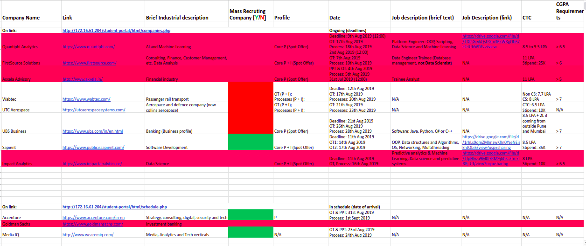

# Placements

This folder contains placement details of the past batches. The placement portal will open on link http://172.16.61.204/student-portal/html/index.php

## Table of contents

- [Placements](#placements)
  - [Table of contents](#table-of-contents)
    - [Resources](#resources)
  - [Batch wise summary](#batch-wise-summary)
    - [2020](#2020)
      - [Placement Schedule](#placement-schedule)

### Resources

- **Aptitude**
  - __Group Discussion__
    - [indiabix.com](https://www.indiabix.com/group-discussion/topics-with-answers/)
  - __Puzzles__
    - [GeeksForGeeks Puzzles](https://www.geeksforgeeks.org/category/puzzles/)
    - [Job interview puzzles](https://www.analyticsvidhya.com/blog/2016/07/20-challenging-job-interview-puzzles-which-every-analyst-solve-atleast/)
    - [Tech inteview puzzles](https://puzzlefry.com/top-25-tech-interview-puzzles-with-answers/)
    - [Analytics interview](https://www.analyticsvidhya.com/blog/2014/09/commonly-asked-puzzles-analytics-interviews/)
    - [Brain teasers](http://www.crazyforcode.com/brain-teasers/)
- **Coding**
  - __Programming Languages__
    - [HackerRank Python](https://www.hackerrank.com/domains/python)
    - [HackerRank C++](https://www.hackerrank.com/domains/cpp)
  - __Data Structures and Algorithms__
    - [HackerRank Data Structures](https://www.hackerrank.com/domains/data-structures)
    - [HackerRank Algorithms](https://www.hackerrank.com/domains/algorithms)
  - __Interview__
    - [Hackerrank Interview preparation kit](https://www.hackerrank.com/interview/interview-preparation-kit)
    - [crazyforcode Interview puzzles](http://www.crazyforcode.com/top-10-interview-puzzles/)

## Batch wise summary

Batches are given as per the year of graduation

### 2020

Batch of 2016-2020 placement can be found in [this](./Batch_2020/Placement_stats.xlsx) file

#### Placement Schedule

Placement Schedule

