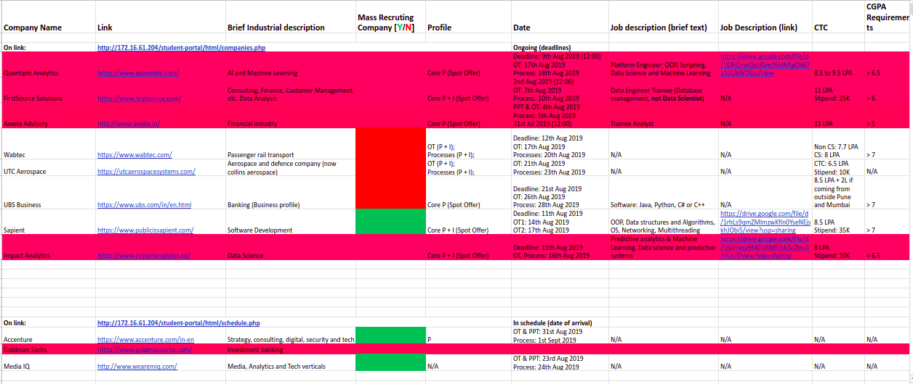

# MIT-Mechatronics-Resources

A collection of useful links and discussions regarding Projects, Placements, masters and other stuff for/by the students of Mechatronics at Manipal Institute of Technology, Manipal.

## Table of contents

- [MIT-Mechatronics-Resources](#mit-mechatronics-resources)
  - [Table of contents](#table-of-contents)
  - [Categories](#categories)
    - [Course](#course)
    - [Placement](#placement)
    - [Advice](#advice)
  - [Contributors](#contributors)
    - [Want to be a contributor](#want-to-be-a-contributor)

## Categories

### Course

  - [2014-2018 Batch drive links](./Course/Batch_2014_2018/README.md#drivelinks)
  - [Topics](./Course/Topics/README.md)
    - [Mathematics](Course/Topics/Mathematics/README.md)
    - [Machine Learning](Course/Topics/Machine_Learning/README.md)
    - [Robotics](Course/Topics/Robotics/README.md)

### Placement

- Placement Scedule for 2020

  

- [Getting ready for placements](Placements/Readme.md/#resources)

  - [Aptitude](Placements/README.md#aptitude)
  
  - [Coding](Placements/README.md#coding)

- Latest Batch of 2020 placement  stats to be updated [here](./Placements/Batch_2020/Placement_stats.xlsx).

### Advice

- [2016-2020 batch](Advice/Batch_2016_2020/README.md)
  - [Placement advice](Advice/Batch_2016_2020/README.md#placementsadvice)

## Contributors

- [Sambhav300899](https://github.com/Sambhav300899)
- [Soulbliss](https://github.com/soulbliss)
- [TheProjectsGuy](https://github.com/TheProjectsGuy)

### Want to be a contributor

If you want to be a contributor, please read the [contributing file](./.github/contributing.md)
